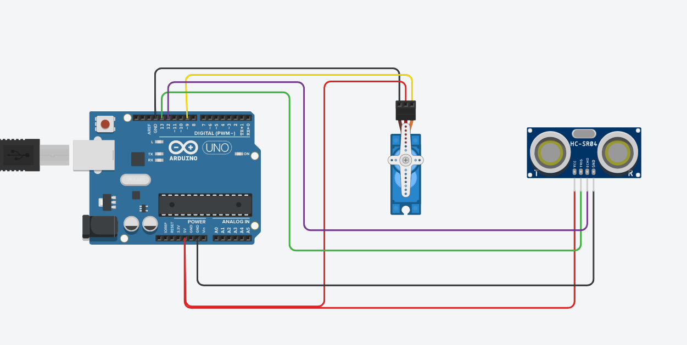
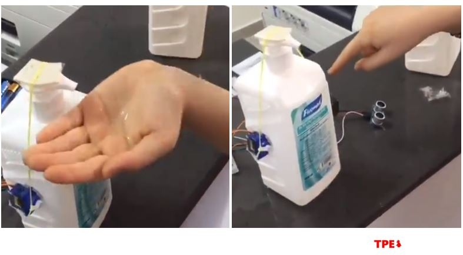

# Touchless-Sanitizer

A budget-friendly touchless sanitizer which uses Arduino, Ultrasonic Sensor(HC-SR04) and a 9G Servo.

<h1>Circuit Diagram</h1>

<h1>Setup-</h1>

Run and upload the code to your Arduino and you are ready to go

<h1>Date Created-19 March 2020</h1>
